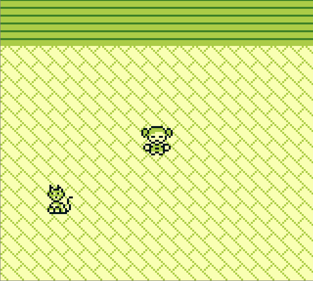

# JRPG

A small jrpg written in Clojure using LWJGL.

This is a rewrite of my old [Pokemon Techdemo in Kantan](https://github.com/Funkschy/pokemon-wannabe)

### Controls
- WASD to move
- Space to interact

### Why rewrite the game in Clojure?
I like Clojure

### Dependencies
- Java (i developed it with java 17, but older versions should work)
- [Leiningen](https://leiningen.org/)

I included the native LWJGL dependencies for Linux, MacOs and Windows, so the game should run fine on all
of those, but i personally only test on Linux.

### Building
Just type `lein run` if you want to run the game, or `lein uberjar`, to precompile the code and
create a standalone jar file inside the target folder, which you can run with `java -jar target/jrpg-0.1.0-SNAPSHOT-standalone.jar`
